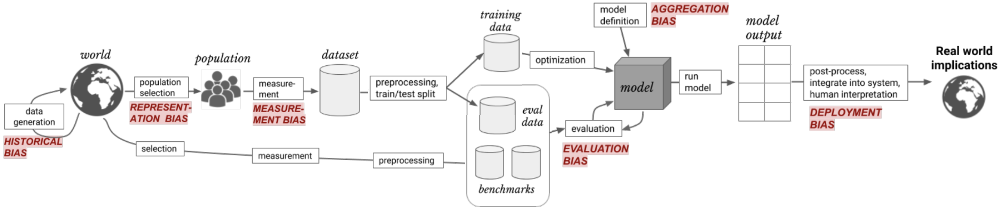

# Intro to AI Ethics Free Course - Kaggle

Table of Contents

- [Overview](#overview)
- [1. Introduction to AI Ethics](#1-introduction-to-ai-ethics)
- [2. Human-Centered Design for AI](#2-human-centered-design-for-ai)
- [3. Identifying Bias in AI](#3-identifying-bias-in-ai)
- [4. AI Fairness](#4-ai-fairness)
- [5. Model Cards](#5-model-cards)
- [References](#references)

## Overview

Explore practical tools to guide the moral design of AI systems.

### 1. Introduction to AI Ethics

Learn what to expect from the course.

### 2. Human-Centered Design for AI

Design systems that serve people’s needs. Navigate issues in several real-world scenarios.

6 Steps to Design HCD AI Systems:

1. Understand people’s needs to define the problem
2. Ask if AI adds value to any potential solution
3. Consider the potential harms that the AI system could cause
4. Prototype, starting with non-AI solutions
5. Provide ways for people to challenge the system
6. Build in safety measures

### 3. Identifying Bias in AI

Bias can creep in at any stage in the pipeline. Investigate a simple model that identifies toxic text.

6 types of bias (Src: [link](https://arxiv.org/pdf/1901.10002.pdf)):
- historial bias
- reprensentations bias
- measurements bias
- aggregation bias
- evaluation bias
- deployment bias  

Bias framework:

(Src: [link](https://arxiv.org/pdf/1901.10002.pdf))

### 4. AI Fairness

Learn about four different types of fairness. Assess a toy model trained to judge credit card applications.

4 fairness criteria (Src: [link](https://arxiv.org/pdf/1710.03184.pdf))

1. Demographic parity/ statistical parity
2. Equal opportunity (TPR based/[confusion matrix](https://en.wikipedia.org/wiki/Confusion_matrix))
3. Equal accuracy
4. Group unaware / "Fairness through unawareness"

### 5. Model Cards

Increase transparency by communicating key information about machine learning models.

9 model card sections(Src. [Link](https://arxiv.org/pdf/1810.03993.pdf)): 

1. Model Details
2. Intended Use
3. Factors
4. Metrics
5. Evaluation Data
6. Training Data
7. Quantitative Analyses
8. Ethical Considerations
9. Caveats and Recommendations

- [Model Card - Smiling Detection in Images](https://github.com/Kaggle/learntools/blob/master/notebooks/ethics/pdfs/smiling_in_images_model_card.pdf)
- [Model Card - Toxicity in Text](https://github.com/Kaggle/learntools/blob/master/notebooks/ethics/pdfs/toxicity_in_text_model_card.pdf)

## References

- [Course link Kaggle](https://www.kaggle.com/learn/intro-to-ai-ethics)

Tools

- [Human Centered Design](https://en.wikipedia.org/wiki/Human-centered_design#:~:text=Human%2Dcentered%20design%20is%20an,and%20usability%20knowledge%20and%20techniques.)

- [Differential Privacy - Google](https://developers.googleblog.com/2019/09/enabling-developers-and-organizations.html)
- [Federated Learning - Google](https://blog.research.google/2017/04/federated-learning-collaborative.html)

**HCD Application to AI:**

- Lex Fridman’s [introductory lecture](https://www.youtube.com/watch?v=bmjamLZ3v8A) on Human-Centered Artificial Intelligence
- Google’s People + AI Research (PAIR) [Guidebook](https://pair.withgoogle.com/guidebook/)
- Stanford Human-Centered Artificial Intelligence (HAI) [research](https://hai.stanford.edu/research)

**Identifying Bias:**

To continue learning about bias, check out [the Jigsaw Unintended Bias in Toxicity Classification](https://www.kaggle.com/c/jigsaw-unintended-bias-in-toxicity-classification/overview) competition that was introduced in this exercise.

- Kaggler [Dieter](https://www.kaggle.com/christofhenkel) has written a helpful two-part series that teaches you how to preprocess the data and train a neural network to make a competition submission. [Get started here](https://www.kaggle.com/christofhenkel/how-to-preprocessing-for-glove-part1-eda).
- Many Kagglers have written helpful notebooks that you can use to get started. [Check them out](https://www.kaggle.com/c/jigsaw-unintended-bias-in-toxicity-classification/notebooks?sortBy=voteCount&group=everyone&pageSize=20&competitionId=12500) on the competition page.

Another Kaggle competition that you can use to learn about bias is the [Inclusive Images Challenge](https://www.kaggle.com/c/inclusive-images-challenge), which you can read more about in [this blog post](https://blog.research.google/2018/09/introducing-inclusive-images-competition.html). 

The competition focuses on evaluation bias in computer vision.

**AI Fairness:**

- [Impossibility Theorem of Machine Fairness](https://arxiv.org/abs/2007.06024)
- Explore different types of fairness with an [interactive tool](http://research.google.com/bigpicture/attacking-discrimination-in-ml/).
You can read more about equal opportunity in [this blog post](https://ai.googleblog.com/2016/10/equality-of-opportunity-in-machine.html).
Analyze ML fairness with [this walkthrough](https://pair-code.github.io/what-if-tool/learn/tutorials/walkthrough/) of the What-If Tool, created by the [People and AI Research (PAIR) team at Google](https://pair.withgoogle.com/). This tool allows you to quickly amend an ML model, once you've picked the fairness criterion that is best for your use case.

Further reading:

- [partnershipai.org](https://partnershiponai.org/search/?search=fairness)
- [FAIR (The Fundamental/(Facebook) Artificial Intelligence Research) - Responsible AI - progress and learnings across socially responsible AI research - metaai](https://ai.meta.com/blog/fair-progress-and-learnings-across-socially-responsible-ai-research/)
- [ACM Conference on Fairness, Accountability, and Transparency (ACM FAccT)](https://facctconference.org/)

**Model Cards:**

- [Model Cards for AI Model Transparency](https://blog.salesforceairesearch.com/model-cards-for-ai-model-transparency/)
- [Open AI’s model card for GPT-3](https://github.com/openai/gpt-3/blob/master/model-card.md)
- [Google Cloud's example model cards - Face Detection](https://modelcards.withgoogle.com/face-detection)
- [Huggingface Model cards](https://huggingface.co/docs/hub/model-cards)

Further read: 
- [AI FactSheets 360](https://aifs360.res.ibm.com/)

Papers: 

- [Human-Centered Design for AI](/docs/papers/)
- [Identifying Bias in AI](/docs/papers/)
- [AI Fairness](/docs/papers/)
- [Model Cards](/docs/papers/)

